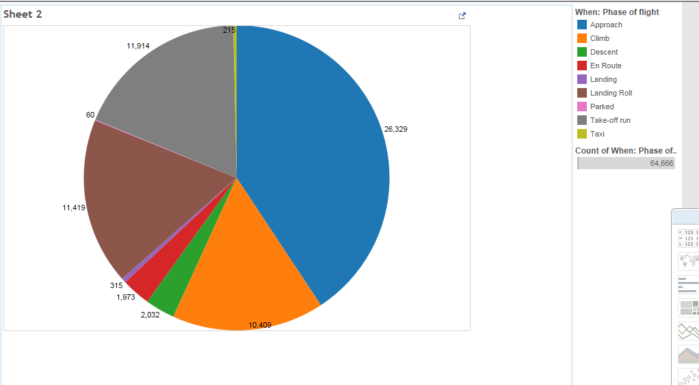

# Report

Using Tableau, create visualization for each question in the report regarding
bird strikes.

# Authors

This report is prepared by
* [Caleb Hsu](https://github.com/calebhsu/)
* [Andrew Linenfelser](https://github.com/Linenfelser)
* [Zhili Yang](https://github.com/zhya215)
* [Andrey Shprengel](https://github.com/AndreyShprengel)
* [Andrew Berumen](https://github.com/anbe6083)

# What are the top 5 bird species that are involved?

This question was asked by ZachLamb.

The largest bubbles indicate the greatest number of occurences of a particular species in the birdstrike. The number below each species indicates the average cost in hours incurred by said species.

# What states cost the airlines the most money?

This question was asked by willzfarmer.

The number of bird strikes is graphed according to origin state, along with the sum of total costs of damage due to birdstrikes

# What type of aircraft has the most instances of damaged caused by bird strikes?

This question was asked by nicolele.

The bar graph indicates that airplanes were the type of aircraft with the most instances of damaged caused.

# How many flights have been cancelled by birdstrikes?

This question was asked by pail4944 .

The bar graph indicates the number of occurrences and the type of cancellation that occured.

# What is the most common flight phase where a birdstrike occurred?

This question was asked by KevinKGifford.

This pie chart represents what portion of the birdstrikes happened during each phase.
The legend on the right indicates the most common phase was Approach.   
