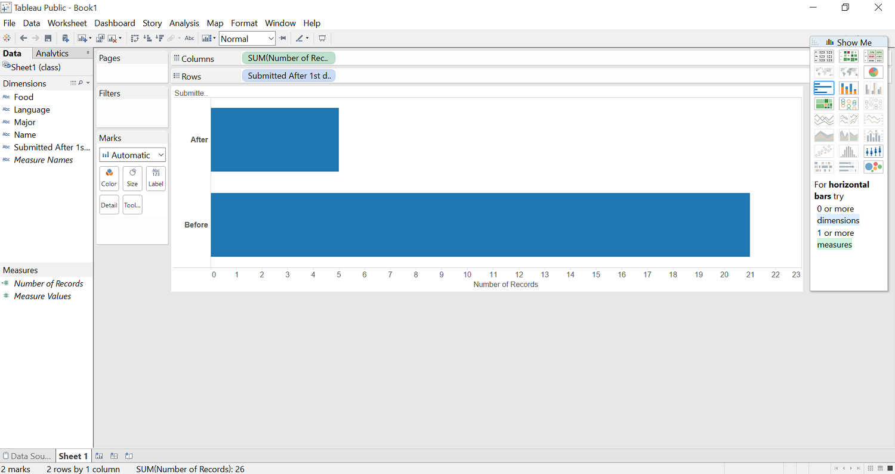
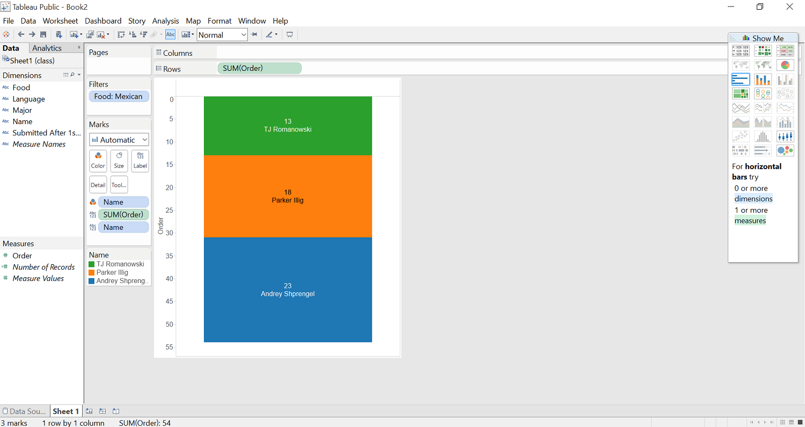

# Tableau Visualization

Tableau is arguably the biggest deal now in terms of data visualization for non-programmers.
Let's pretend you are not a programer. Learn and experience what it is like to make
visualizations using Tableau to answer the same questions about your classmates in our course.

For each of the question, think about what chart you should use to convey your answer and
make your best effort to create something that makes sense to you. There's no right
or wrong. When we meet in the class again, we will set aside time for each team to discuss
and compare the variety of visualization solutions each member has come up with for the
same set of questions. It will be fun!

To include a Tableau visualization in your report, take a screenshot, save it as an image,
put it in the `learning/week2` folder, and replace ``  with
your own image. Please makes sure your screenshot includes the _entire_ Tableau interface
including the controls, widgets ...etc.

# How big of a deal Tableau really is?

According to [Forbes](http://www.forbes.com/sites/greatspeculations/2015/04/15/a-closer-look-at-tableaus-customer-base-growth/), Tableau is a growing startup that had around 4,400 customers at the end of 2010, and was projected to have 26,000 customers in 2014. Due to the fact that the business analytics industry grew by 8% in 2012 and 2013, software like Tableau is definitely in high demand, especially due to it's attempts to make data visualization easy and accessible to non-programmers.

# How many Applied Math majors are there?

The ratio of Applied Math majors to Computer Science and other majors is displayed by the yellow slice of the pie chart.

# How many people submitted after August 24th?

The top bar displays the numbers of students who submitted after August 24th, while the bottom bar displays the number of students who submitted before.

# Who was the first person to submit Mexican food as their favorite food?

The order of submissions is on the y-axis and grows downwards; therefore the first block displayed is the first student who submitted, accompanied by their order of submission.

# How many people submitted before noon? 

The light blue boxes indicate the students who submitted before noon, while the dark blue boxes indicate students who submitted after noon.
