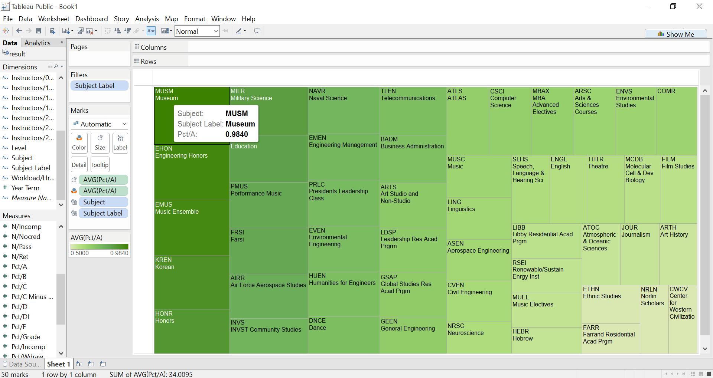
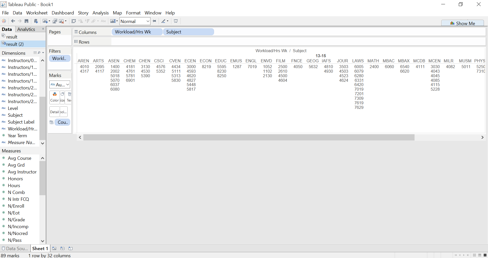
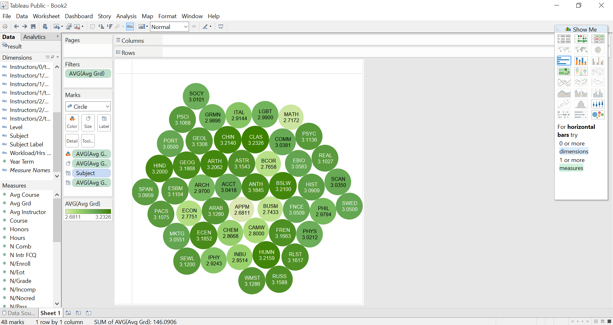
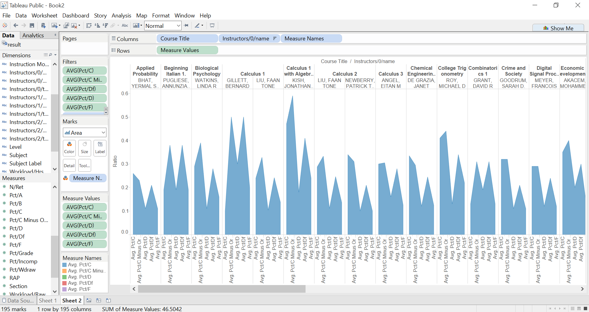

# Visualization

Using Tableau, create visualization for each question in the report. You will
work on this independently just like last week.

To include a Tableau visualization in your report, take a screenshot, save it as an image,
put it in the `learning/week2` folder, and replace ``  with
your own image. Please makes sure your screenshot includes the _entire_ Tableau interface
including the controls, widgets ...etc.

# Import

Data: [fcq.clean.json](https://github.com/bigdatahci2015/book/blob/master/hackathons/fcq/fcq.clean.json)

(a copy of this file is in your book repository already in the directory `hackathons/fcq`)

This dataset is provided to you in the JSON format. Your first task is to figure out
how to transform this JSON file into a format that can be fed into Tableau. As
a junior and senior, you are expected to be able to look around the Internet
to problem solve.

# What department should I take classes in if I want to boost my GPA? 

The largest box in the upper left displays the subject name and label for the department of classes in which the percentage of students who receive an A is the highest. 

# Which classes have the maximum hours spent (13-15) per week? 

The table lists the courses in each department that have the highest workload in terms of hours spent on the class per week.

# What department has the lowest average GPA?

The lightest bubbles indicate departments with the lowest GPA. The data was filtered to only display departments with average GPAs of 3.25 and lower for readability purposes.

# Which classes (with specific professors) damaged the most students? 

The area graphs under each class show the percentage of students who received a C, C-, D, and F in the class respectively. The data was filtered to only display classes where the percentage of students with bad grades was greater than 10%.